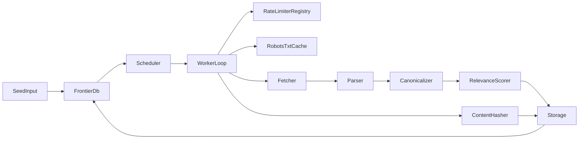

# Crawler Architecture Overview

## System Goal

Build a preferential web crawler for segmentation-related repositories, centered on `github.com`, compliant with assignment constraints and robots/rate-limit policies.

## Architecture Layers

- **Layer 1 (assignment view)**: HTTP downloader/renderer, data extractor, duplicate detector, URL frontier, datastore.
- **Layer 2 (engineering view)**: `Scheduler`, `Worker`, `Fetcher`, `Parser`, `Canonicalizer`, `RobotsTxtCache`, `RateLimiterRegistry`, `RelevanceScorer`, `ContentHasher`, `Storage`, `Frontier`.

## High-Level Components

- `Scheduler`: starts/stops workers and handles graceful termination.
- `Worker`: orchestrates dequeue -> policy checks -> fetch -> parse -> deduplicate -> persist.
- `Frontier`: database-backed priority queue (`FRONTIER`, score descending, lock-safe claims).
- `Fetcher`: domain-aware renderer (`HttpClient` for GitHub, Selenium for JS-heavy pages).
- `Parser`: extracts text, links (`href` + `onclick`), and image refs.
- `Storage`: authoritative persistence and SQL contracts.

## Dependency Rule

Components depend on interfaces, not concrete classes. Cross-component calls MUST flow through contracts in `technical-specifications/TS-01-interface-contracts.md`.

## Core Diagram

## Output and Persistence

- URLs discovered are normalized, scored, deduplicated, and inserted to frontier.
- Fetch results are persisted as `HTML`, `BINARY`, or `DUPLICATE`.
- Link graph is persisted for every discovered relationship, including already-seen targets.
