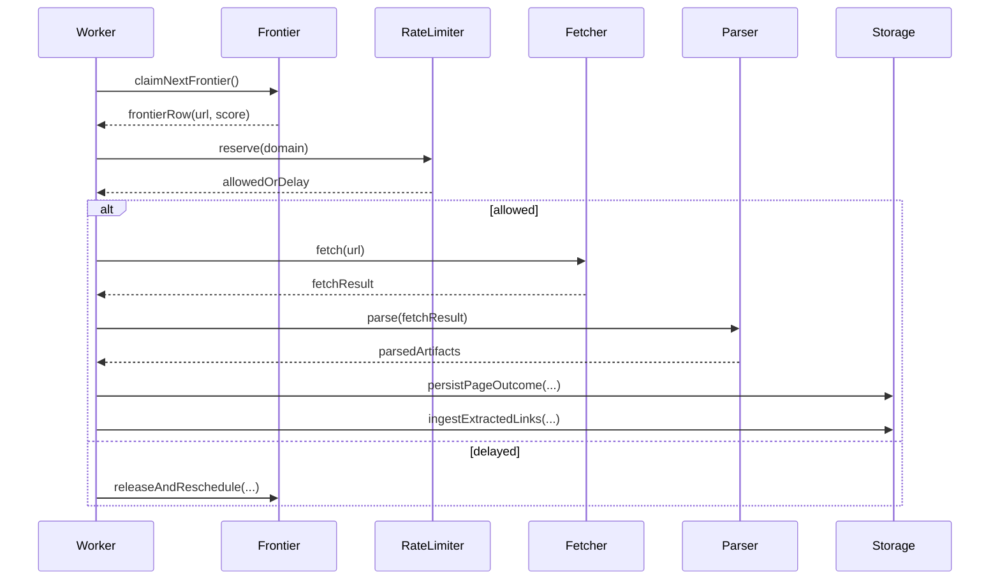

# System Sequence And Dataflow

## Stage Model

- **Stage A (ingestion):** extracted URL -> canonicalize -> robots check -> dedup check -> score -> frontier insert + link insert.
- **Stage B (fetch):** claim frontier row -> rate-limit gate -> fetch -> parse -> persist -> feed extracted links to Stage A.

## End-to-End Sequence

## Page Lifecycle

`FRONTIER` -> `HTML` or `BINARY` or `DUPLICATE`.

- URL duplicate: no new `page` row, but `link` row still inserted.
- Content duplicate: page row updated to `DUPLICATE`, `html_content` cleared.

## Transaction Boundaries

- claim is done in transaction with row lock;
- processing after claim is outside lock when possible;
- final state update is atomic per page outcome;
- ingestion of extracted links is idempotent and safe under concurrent workers.

## Termination Contract

Crawl is done when:
- no `FRONTIER` rows remain, and
- no worker currently holds a claimed row in progress.
