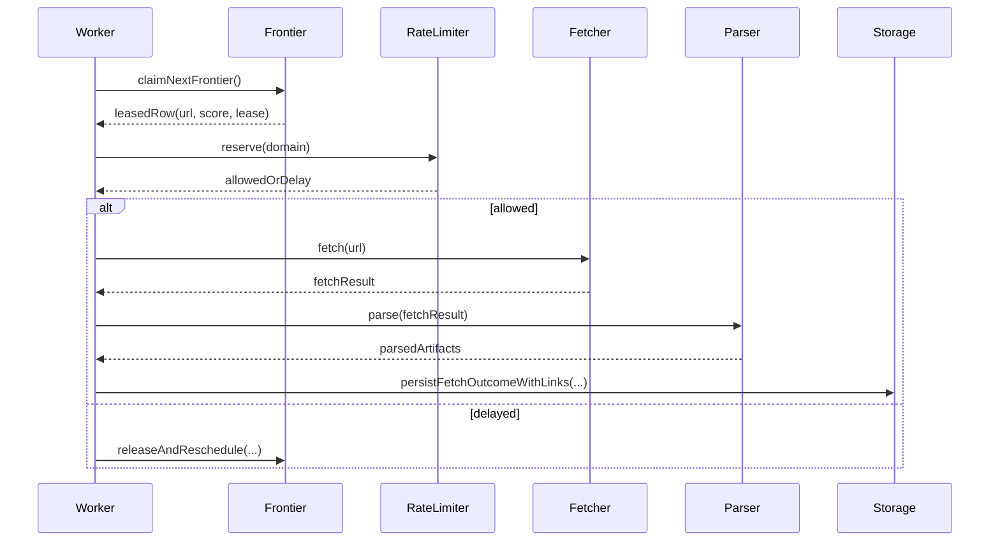

# System Sequence And Dataflow

## Stage Model

- **Stage A (ingestion):** extracted URL -> canonicalize -> robots check -> dedup check -> score -> frontier insert + link insert.
- **Stage B (fetch):** atomic claim of eligible frontier row -> rate-limit gate -> fetch -> parse -> persist -> feed extracted links to Stage A.

Robots metadata flow:
- robots loading may be triggered from Stage A ingestion and Stage B fetch path;
- both paths MUST call the same `robotsTxtCache.ensureLoaded(domain)` implementation with per-domain single-flight semantics;
- `/robots.txt` fetch uses the same domain limiter budget as content fetches and persists `site` metadata;
- robots disallow decisions in Stage A happen before frontier insert; Stage B performs a pre-fetch robots gate before content fetch.

## End-to-End Sequence

## Page Lifecycle

`FRONTIER` -> `PROCESSING` -> `HTML` or `BINARY` or `DUPLICATE` or `ERROR`.

- URL duplicate: no new `page` row, but `link` row still inserted.
- Content duplicate: page row updated to `DUPLICATE`, `html_content` cleared.
- Fetch overload (`429`/`503`): row is rescheduled using domain backoff policy.
- Retryable failures: page transitions `PROCESSING -> FRONTIER` with future `next_attempt_at`.
- Stale lease recovery: expired `PROCESSING` rows are reclaimed back to `FRONTIER`.

## Transaction Boundaries

- claim is done in transaction with row lock and state mutation (`FRONTIER -> PROCESSING`);
- processing after claim is outside lock when possible;
- final state update is atomic per page outcome or retry transition;
- ingestion of extracted links is idempotent and safe under concurrent workers.

## Termination Contract

Crawl is done when:
- no claimable `FRONTIER` rows remain (`next_attempt_at <= now()`), and
- no worker currently holds a valid in-progress lease.
